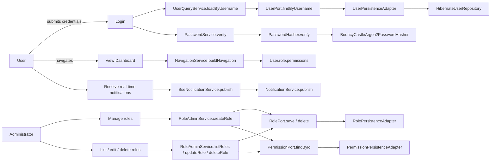
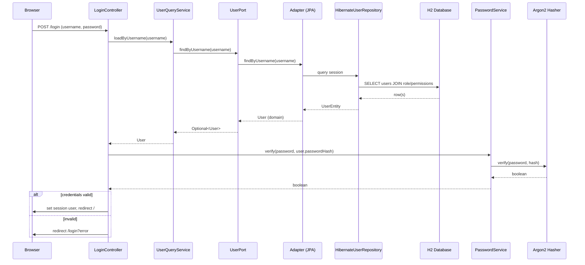
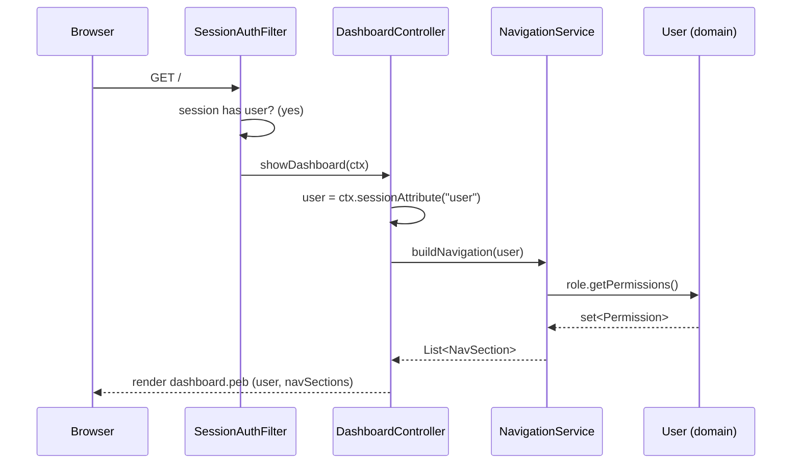
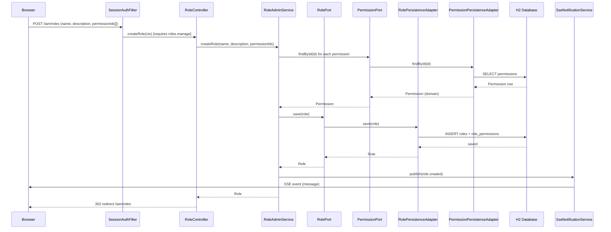
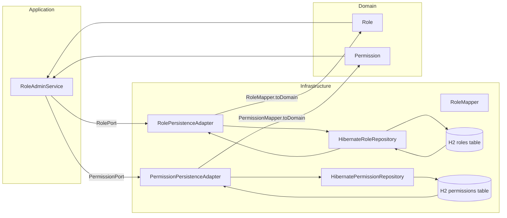
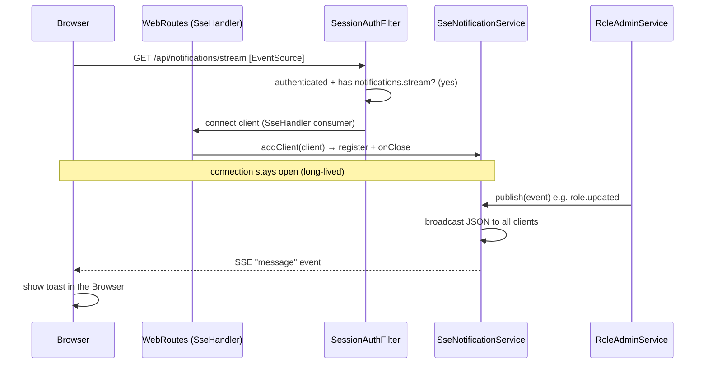

# Library Ultimate — Architecture & Use Cases

This document describes the modular architecture of the Library management
system, the **use cases** of the IAM feature, and the **data flow** between
classes at runtime. It is written at the code level so a developer can trace a
request end-to-end.

---

## 1. Project structure (Maven multi-module)

```
library-ultimate (parent POM — aggregator)
├── iam                       (feature aggregator POM)
│   ├── iam-domain            (pure business rules, NO framework)
│   ├── iam-application       (use cases / application services)
│   └── iam-infrastructure    (adapters: JPA, HTTP, security, templates)
└── bootstrap                 (ONLY runnable module — composition root)
    ├── LibraryApplication    (main() — wires everything, starts Javalin)
    ├── db/migration          (Flyway migrations)
    ├── templates/            (Pebble templates)
    └── static/               (CSS/JS)
```

**Dependency rule (hexagonal / clean architecture):**
```
bootstrap → iam-infrastructure → iam-application → iam-domain
                                        │                ▲
                                        └──────ports─────┘
```
Dependencies point **inward** (from infrastructure to domain). The domain
knows nothing about JPA, HTTP, or templates.

---

## 2. Class map by layer

### Domain (`iam-domain`) — zero framework dependencies
| Class | Responsibility |
|---|---|
| `User` | Aggregate root: identity, credentials (hash), enabled flag, role |
| `Role` | Groups a set of permissions; `hasPermission(code)` |
| `Permission` | Granular right (`resource.action`), menu metadata, module |
| `Module` | Top-level functional area (dashboard, iam, ...) |
| `LoadUser` (port-in) | Declares the `loadByUsername` use case |
| `UserPort`/`RolePort`/`PermissionPort`/`ModulePort` (port-out) | Persistence contracts |
| `PasswordHasher` (port-out) | Cryptography contract (hash + verify) |

### Application (`iam-application`) — use cases
| Class | Responsibility |
|---|---|
| `UserQueryService` | Implements `LoadUser`; loads a user by username |
| `NavigationService` | Builds the dynamic sidebar from the user's permissions |
| `PasswordService` | Wraps `PasswordHasher` port |
| `NavItem` / `NavSection` (DTO) | Immutable output DTOs for the template |

### Infrastructure (`iam-infrastructure`) — adapters
| Class | Responsibility |
|---|---|
| `UserPersistenceAdapter` etc. | Implement the output ports |
| `HibernateUserRepository` etc. | Thin Hibernate `Session` wrappers |
| `UserEntity` etc. | JPA entities (persistence model) |
| `BouncyCastleArgon2PasswordHasher` | Argon2id implementation |
| `LoginController` | Handles login form (GET + POST) |
| `DashboardController` | Renders the dashboard with dynamic menu |
| `SessionAuthFilter` | Session-based auth guard |
| `WebRoutes` | Registers routes + filter on Javalin |

---

## 3. Use-Case diagram



---

## 4. Sequence: Login (authentication flow)



---

## 5. Sequence: Dashboard (dynamic navigation)



---

## 5b. Sequence: Manage role (create) + real-time notification



## 5c. Data flow: role management (persistence)



---

## 5d. Sequence: subscribe to real-time notifications (SSE)



---

## 6. Data flow diagram (persistence)

```mermaid
flowchart LR
    subgraph Application
        S[UserQueryService]
    end
    subgraph Infrastructure
        A[UserPersistenceAdapter]
        R[HibernateUserRepository]
        M[UserMapper]
        E[(H2 users table)]
    end
    subgraph Domain
        D[User]
    end

    S -->|UserPort| A
    A -->|findByUsername| R
    R -->|HQL/JPA| E
    E -->|UserEntity| R
    R -->|UserEntity| A
    A -->|UserMapper.toDomain| D
    D -->|User (domain)| S
```

---

## 7. Security flows

- **Password storage:** Argon2id via BouncyCastle (`BouncyCastleArgon2PasswordHasher`).
  Stored as `$argon2id$v=19$m=19456,t=2,p=1$<salt>$<hash>` with a random 16-byte
  salt per hash. Constant-time comparison on verify.
- **Authentication:** server-side HTTP session stores the `User`. No tokens in
  cookies. `SessionAuthFilter` rejects unauthenticated requests to protected paths.
- **Authorization:** RBAC. The sidebar is built dynamically from the user's
  role permissions (least privilege by construction).
- **Post-quantum note:** the project uses BouncyCastle and is structured so the
  TLS/transport layer can be upgraded to hybrid post-quantum key exchange
  (e.g. X25519Kyber768) without touching the domain.

---

## 8. Startup flow (`LibraryApplication`)

```mermaid
flowchart TD
    A[main] --> B[Build Hibernate SessionFactory]
    B --> C[Run Flyway migrations]
    C --> D[Build persistence adapters]
    D --> E[Seed admin password hash]
    E --> F[Build services + controllers]
    F --> G[Register Javalin routes]
    G --> H[Start Javalin on 0.0.0.0:8080]
    H --> I[Open browser at /login]
